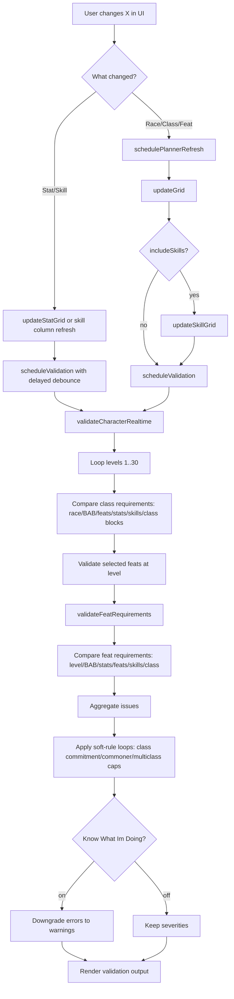

# Arelith Spell Tools - Setup & Usage Guide

Spell Queue Builder and Spell Search & Filter utility with shared data parsing.

## License

This repository is licensed under **AGPL-3.0-or-later**.

- See [LICENSE](LICENSE).
- If you modify and distribute this project, you must provide source under AGPL-compatible terms.
- If you run a modified version for users over a network, you must provide corresponding source to those users.

### Local REUSE check on every commit

Enable repo-tracked hooks once per clone:

```powershell
powershell -ExecutionPolicy Bypass -File scripts/enable-git-hooks.ps1
```

This makes Git run `python -m reuse lint` before each commit.
If REUSE fails, the commit is blocked locally until fixed.

## Quick Start

### Prerequisites
- **Node.js** (v14 or higher) - [Download here](https://nodejs.org/)
- No additional npm packages required - the scripts use only built-in Node modules

### Generate All Data & Build

```bash
node rebuild.js
```

This parses XML data, combat statistics, merges them, and builds HTML files. Takes ~5-10 seconds.

---

## Individual Scripts

Run parsing steps separately (optional):

### Step 1: Parse Sequence Builder Data
```bash
node parsing/parseSpellsAndFeats.js
```
Reads: `docs/ArelithClassData.xml`, `docs/ArelithSpellsandFeats.xml`
Outputs: `Parsed/combinedSpellFeatData.json`, `Parsed/notFound.json`

### Step 2: Parse Combat Data
```bash
node SpellSearch/parseCombatData.js
```
Reads: `DirectDmginfo.txt`, `AOEDmgInfo.txt` (root directory)
Outputs: `SpellSearch/combatData.json`

### Step 3: Generate Enhanced Spell Database
```bash
node SpellSearch/parseSpellsEnhanced.js
```
Reads: XML data + `combatData.json`
Outputs: `SpellSearch/enhancedSpellData.json` (356 spells)

### Step 4: Build Standalone HTML Files
```bash
node SpellSearch/buildStandalone.js
node parsing/buildStandalone.js
```
Outputs: `spellSearch_standalone.html`, `SequenceBuilder/sequenceBuilder_standalone.html`

---

## Project Structure

```
.
├── index.html                          # Landing page with tool navigation
├── SequenceBuilder/
│   ├── sequenceBuilder_standalone.html # Spell Queue Builder (standalone)
│   └── sequenceBuilder.html            # Spell Queue Builder (source)
├── rebuild.js                          # Master build script (run this!)
├── _config.yml                         # Jekyll config for GitHub Pages
├── .nojekyll                           # Tells GitHub Pages to skip Jekyll
│
├── docs/
│   ├── ArelithClassData.xml           # Class data from Arelith wiki
│   ├── ArelithSpellsandFeats.xml      # Spell data from Arelith wiki
│   └── assets/
│       └── style.scss                  # Shared styling
│
├── SpellSearch/
│   ├── spellSearch_standalone.html     # Spell Search & Filter (final)
│   ├── spellSearch.html                # Spell Search & Filter (source)
│   ├── parseSpellsEnhanced.js          # Enhanced parser (extracts tags, damage types, etc)
│   ├── parseCombatData.js              # Combat stats parser
│   ├── buildStandalone.js              # HTML builder
│   ├── enhancedSpellData.json          # Generated: 356 spells with metadata
│   └── combatData.json                 # Generated: 133 combat entries
│
├── Parsed/
│   ├── combinedSpellFeatData.json      # Generated: 367 combined entries
│   └── notFound.json                   # Generated: 479 items not in XML
│
├── parsing/
│   ├── parseSpellsAndFeats.js          # Sequence Builder parser
│   ├── buildStandalone.js              # Sequence Builder HTML builder
│   ├── groupNotFound.js                # Helper to organize missing items
│   └── buildStandalone.js              # Builder for Sequence Builder
│
├── SETUP_GUIDE.md                      # This file
├── GITHUB_PAGES.md                     # GitHub Pages deployment guide
└── README.md                           # Project overview
```

---

## Data File Specifications

### Required Input Files

**XML Files:**
- `docs/ArelithSpellsandFeats.xml` - Export wiki categories: `category:spells category:feats`
- `docs/ArelithClassData.xml` - Export wiki category: `category:class`

To export from MediaWiki:
1. Go to Special:Export page
2. Enter categories
3. Download XML
4. Replace the corresponding file in `docs/`

**Combat Data Files:**
- `DirectDmginfo.txt` - Tab-separated damage spell stats (Spell, Level, Range, Saves, Effects, SR Note, Damage Formula, Type, Max Damage, Avg Damage, AoE Type)
- `AOEDmgInfo.txt` - Tab-separated persistent AoE stats (Spell, Level, Check Timing, Speed Reduction)

### Generated Output Files

**enhancedSpellData.json** (356 spells)
```json
{
  "id": "58",
  "name": "Fireball",
  "school": "Evocation",
  "innateLevel": "3",
  "classes": [{"class": "Sorcerer", "level": 3}, ...],
  "damageTypes": ["Fire"],
  "tags": ["Fire"],
  "description": "The caster unleashes a fiery projectile...",
  "combatInfo": {
    "damageFormula": "1d6 per 1",
    "maxDamage": "90 (15d6)",
    "avgDamage": "52.5",
    "combatRange": "40",
    "combatEffects": "½",
    "combatAoE": "a",
    "isPersistentAoE": false
  }
}
```

**combatData.json** (133 spells)
```json
{
  "fireball": {
    "damageFormula": "1d6 per 1",
    "maxDamage": "90 (15d6)",
    "avgDamage": "52.5",
    "combatRange": "40",
    "combatEffects": "½",
    "combatAoE": "a",
    "isDirect": true
  }
}
```

---

## Local Testing

**Generate data:**
```bash
node rebuild.js
```

**Open in browser:**
- File system: `file:///C:/Path/To/Project/SpellSearch/spellSearch_standalone.html`
- Local server: `python -m http.server 8000` then visit `http://localhost:8000/`

---

## GitHub Pages Deployment

**Setup:**
1. Run `node rebuild.js`
2. `git add . && git commit -m "Update spell data" && git push`
3. Enable Pages in repo Settings (Branch: main, Directory: root)

**Required files to push:**
- `index.html`, `_config.yml`, `.nojekyll`
- `SpellSearch/spellSearch_standalone.html` + `enhancedSpellData.json`
- `SequenceBuilder/sequenceBuilder_standalone.html`
- `Parsed/combinedSpellFeatData.json`

**Access:**
- https://yourusername.github.io/repository-name/

---

## Updating Data

1. Replace `docs/ArelithClassData.xml` and `docs/ArelithSpellsandFeats.xml` from wiki export
2. Replace `DirectDmginfo.txt` and `AOEDmgInfo.txt` if combat data changed
3. Run `node rebuild.js`
4. Push to GitHub (auto-updates within minutes)

---

## Troubleshooting

**enhancedSpellData.json not found**
- Run `node rebuild.js` and ensure project root directory is correct

**Combat data missing**
- Check `DirectDmginfo.txt` and `AOEDmgInfo.txt` exist in root directory
- Run `node rebuild.js` again
- Check browser console (F12) for errors

**Data not updating in browser**
- Clear browser cache completely
- For file:// URLs: Close browser completely and reopen
- For http:// URLs: Hard refresh (Ctrl+Shift+R)

**GitHub Pages showing old data**
- Ensure all files are pushed: `git push`
- Wait 2-5 minutes for rebuild
- Verify `SpellSearch/enhancedSpellData.json` is in repository


## Development Notes

### Character Planner Runtime Flow (when you change "X")

`X` = race, class, feat, stat, or skill.



**Main comparisons performed:**
- Class checks: race match, BAB threshold, required feats present, stat minimums, skill minimums, class progression rules.
- Feat checks: required level, BAB, stats, prior-feat logic (`anyOf`/`allOf`/`noneOf`), skill minimums, class requirements.
- Policy checks: 3-level commitment behavior, max distinct classes, Commoner-specific restrictions.

**Main loops in runtime path:**
- `for level = 1..30` in realtime validation and grid/stat/skill refresh paths.
- Nested loops over requirement entries (stats, skills, feats, class blocks) per level.
- Recursive requirement walking for feat prerequisite groups and effective feat expansion/removal resolution.

### Data Pipeline Flow

```
ArelithXML files
    ↓ (parseSpellsAndFeats.js)
    ↓
combinedSpellFeatData.json
    ↓ (parseSpellsEnhanced.js)
    ↓
Damage reference files
    ↓ (parseCombatData.js)
    ↓
combatData.json
    ↓ (parseSpellsEnhanced.js merges)
    ↓
enhancedSpellData.json
    ↓ (buildStandalone.js)
    ↓
spellSearch_standalone.html + JSON files
```

### Key Scripts

- **rebuild.js** - Master orchestrator (run this for everything)
- **parseSpellsEnhanced.js** - Extracts: schools, damage types, tags, ranges, saves, spell resistance, combat stats
- **parseCombatData.js** - Parses tab-separated combat statistics
- **buildStandalone.js** - Creates final HTML files

---
